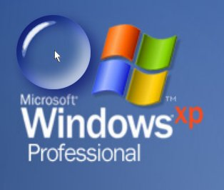



## Bubble Glass Cursor

### Description

it places a Glass Bubble under of the cursor. Run only on XP .

Based in code written by Apeiron

http://www.pscode.com/vb/scripts/ShowCode.asp?txtCodeId=55313&amp;lngWId=1
 
### More Info
 

             |
---                |---
**Submitted On**   |2005-07-31 18:42:44
**By**             |[Agustin Rodriguez](https://github.com/Planet-Source-Code/PSCIndex/blob/master/ByAuthor/agustin-rodriguez.md)
**Level**          |Intermediate
**User Rating**    |4.4 (22 globes from 5 users)
**Compatibility**  |VB 6\.0
**Category**       |[Complete Applications](https://github.com/Planet-Source-Code/PSCIndex/blob/master/ByCategory/complete-applications__1-27.md)
**World**          |[Visual Basic](https://github.com/Planet-Source-Code/PSCIndex/blob/master/ByWorld/visual-basic.md)
**Archive File**   |[Bubble\_Gla191983812005\.zip](https://github.com/Planet-Source-Code/agustin-rodriguez-bubble-glass-cursor__1-62023/archive/master.zip)

